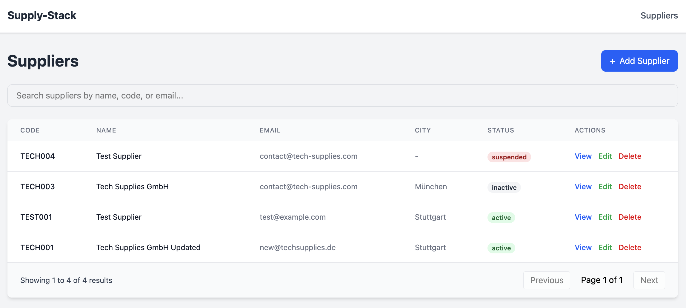
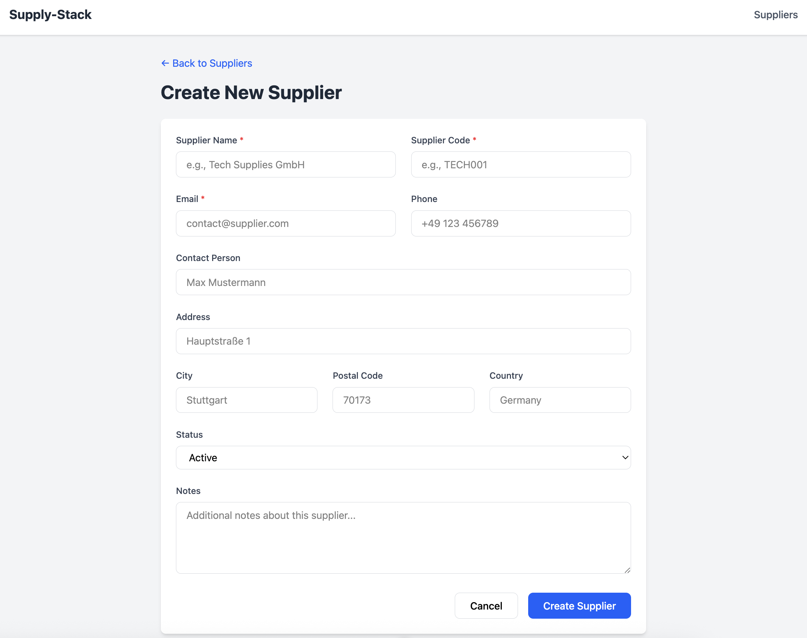
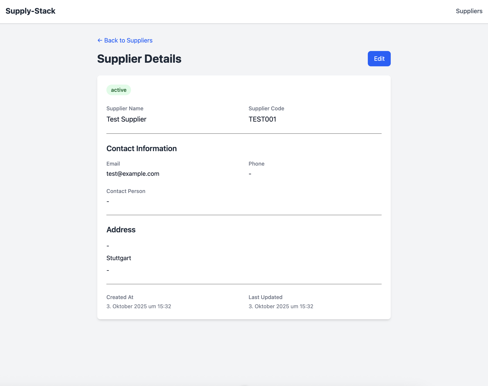
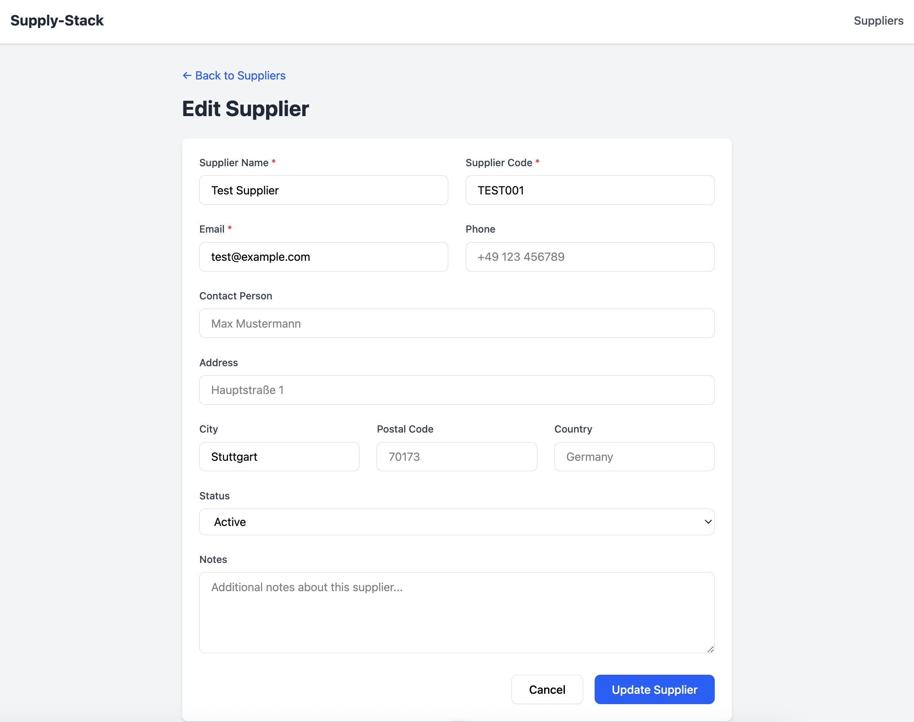

# Supply-Stack

A modern procurement and supplier management platform built with Go, Vue.js, and Docker.



# Table of Contents
[🎯 Project Overview](#-project-overview)  
[🚀 Getting Started](#-getting-started)  
[🛠️ Tech Stack](#-tech-stack)  
[📸 Screenshots](#-screenshots)  
[🚧 Future Enhancements](#-future-enhancements)  
[📝 License](#-license)  

## 🎯 Project Overview

Supply-Stack is a comprehensive supplier management system that enables organizations to:
- Manage supplier relationships and contact information
- Track supplier performance and status
- Search and filter suppliers efficiently
- Maintain detailed supplier records with addresses and notes


## 🚀 Getting Started

### Prerequisites

- **Docker & Docker Compose**

### Setup

1. **Clone the repository**
```bash
   git clone https://github.com/Korbisch/supply-stack.git
   cd supply-stack
```

2. **Configure environment variables (optional)**
```bash
   cp .env.example .env
```
Default values work out of the box. Edit .env only if you need custom configuration.

3. **Start the application**
```bash
   docker compose up -d --build
```

4. **Access the application**
- Frontend: http://localhost:3000
- Backend API: http://localhost:8080/health

## 🛠️ Tech Stack

### Backend
- **Go 1.25** - High-performance backend
- **Gin** - HTTP web framework
- **GORM** - ORM for database operations
- **Postgres** - Relational database

### Frontend
- **Vue 3** - Progressive JavaScript framework
- **TypeScript** - Type-safe development
- **Pinia** - State management
- **Vue Router** - Client-side routing
- **Tailwind CSS v4** - Utility-first CSS
- **Axios** - HTTP client

### Infrastructure
- **Docker & Docker Compose** - Containerization
- **Nginx** - Production web server
- **Multi-stage builds** - Optimized Docker images
- **Network isolation** - Secure container communication

## 📸 Screenshots

### Supplier List


### Create Supplier


### Supplier Details


### Edit Supplier



## 🚧 Future Enhancements

- [ ] JWT Authentication & Authorization
- [ ] Purchase Order Management
- [ ] Request for Quotation (RFQ) system
- [ ] Contract Management
- [ ] Supplier Performance Metrics
- [ ] Dashboard with analytics
- [ ] File upload for supplier documents
- [ ] Email notifications
- [ ] Export to CSV/Excel
- [ ] Unit and integration tests
- [ ] CI/CD pipeline

## 📝 License

This project is for demonstration purposes.

